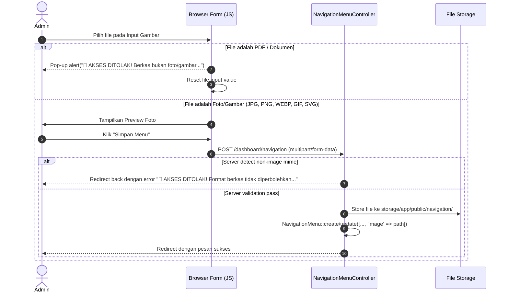

# Design Spec: Upload Foto/Gambar Menu Navigasi dengan Validasi Akses Ditolak

## Overview
Fitur ini menambahkan kemampuan unggah foto/gambar (*Image Upload*) pada modul Menu Navigasi / Sub-Menu di Dashboard Admin. Selain itu, fitur ini menerapkan validasi ketat baik pada sisi klien (JavaScript) maupun server (Laravel) untuk memastikan berkas yang diunggah HANYA berupa gambar/foto. Jika berkas berupa dokumen (seperti PDF, DOCX, XLS, TXT, dll.), sistem akan menolak akses secara langsung dengan notifikasi **"🚫 AKSES DITOLAK!"**.

## Target Components

### 1. Database & Model
- **Migration**: `database/migrations/2026_09_22_000003_add_image_to_navigation_menus_table.php`
  - Menambahkan kolom `image` (`string`, `nullable`) pada tabel `navigation_menus`.
- **Model**: `app/Models/NavigationMenu.php`
  - Menambahkan `'image'` ke properti `$fillable`.

### 2. Backend Controller & Business Logic
- **Controller**: `app/Http/Controllers/Dashboard/NavigationMenuController.php`
  - **Store & Update Validation**:
    - `image` => `nullable|file|mimes:jpeg,png,jpg,webp,gif,svg|max:5120`
    - Pesan Validasi Khusus:
      - `image.mimes` => `🚫 AKSES DITOLAK! Format berkas tidak diperbolehkan. Hanya berkas Foto/Gambar (JPG, PNG, JPEG, WEBP, GIF, SVG) yang diperbolehkan.`
      - `image.file` => `🚫 AKSES DITOLAK! Berkas yang diunggah harus berupa FOTO / GAMBAR.`
      - `image.max` => `🚫 AKSES DITOLAK! Ukuran berkas gambar maksimal adalah 5 MB.`
  - **File Storage**:
    - Berkas gambar disimpan di folder public disk `navigation/` (`storage/app/public/navigation`).
    - Menghapus gambar lama dari storage saat gambar diperbarui atau menu dihapus.

### 3. Frontend View & Modal Form
- **View File**: `resources/views/dashboard/navigation/index.blade.php`
  - Mengubah form `createNavigationForm` dan `editNavigationForm` agar menggunakan `enctype="multipart/form-data"`.
  - Menambahkan field upload gambar pada kedua modal (Tambah & Edit):
    - Input file dengan `accept="image/jpeg,image/png,image/webp,image/gif,image/svg+xml"`.
    - Integrasi handler `onchange="validateImageUpload(this, ...)"`.
    - Pratinjau (*preview*) foto/gambar yang sudah ada atau baru diunggah, lengkap dengan opsi hapus/ganti.
  - Menampilkan thumbnail foto/gambar pada daftar tabel/hirarki menu navigasi dashboard.

### 4. Dynamic Page Frontend
- **View File**: `resources/views/pages/dynamic.blade.php` / `resources/views/profile/show.blade.php`
  - Menampilkan foto banner / gambar header halaman jika menu navigasi memiliki gambar.

## Flow Validasi Keamanan Upload

## Verification Plan
1. Uji coba memilih berkas PDF pada form Tambah/Edit Menu Navigasi -> Pastikan notifikasi **"🚫 AKSES DITOLAK!"** muncul di layar dan input berkas langsung dikosongkan.
2. Uji coba mengunggah berkas foto (JPG/PNG/WEBP) -> Pastikan berhasil disimpan dan gambar muncul pada tabel daftar menu navigasi.
3. Uji coba memperbarui dan menghapus menu navigasi yang memiliki foto -> Pastikan berkas lama terhapus dari storage.
